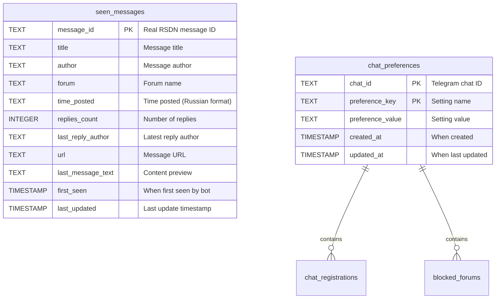

# RSDN Bot - Database Schema

## Entity Relationship Diagram



## Table Details

### 📝 seen_messages
**Purpose**: Cache of all processed RSDN forum messages to prevent duplicates

| Column | Type | Description | Example |
|--------|------|-------------|---------|
| `message_id` | TEXT (PK) | Real RSDN message ID | "8998195" |
| `title` | TEXT | Message title | "Новая версия .NET 9" |
| `author` | TEXT | Original author or latest reply author | "VladD2" |
| `forum` | TEXT | Forum name | "dotnet" |
| `time_posted` | TEXT | Russian time format | "15 мин" |
| `replies_count` | INTEGER | Number of replies | 3 |
| `last_reply_author` | TEXT | Latest reply author | "Явь-истъ" |
| `url` | TEXT | Direct link to message | "https://rsdn.org/forum/message/8998195.1" |
| `last_message_text` | TEXT | Content preview | "Согласен с автором..." |
| `first_seen` | TIMESTAMP | When bot first saw this | "2025-09-28 14:30:00" |
| `last_updated` | TIMESTAMP | Last update | "2025-09-28 14:35:00" |

**Indexes:**
- Primary: `message_id`
- Secondary: `forum`, `first_seen`

### 👥 chat_preferences  
**Purpose**: Multi-chat settings and registrations (key-value store per chat)

| Column | Type | Description | Example |
|--------|------|-------------|---------|
| `chat_id` | TEXT (PK) | Telegram chat ID | "123456789" |
| `preference_key` | TEXT (PK) | Setting type | "registered" / "blocked_forum" |
| `preference_value` | TEXT | Setting value | "true" / "dotnet" |
| `created_at` | TIMESTAMP | When created | "2025-09-28 14:20:00" |
| `updated_at` | TIMESTAMP | Last modified | "2025-09-28 14:25:00" |

**Composite Primary Key**: (`chat_id`, `preference_key`)

**Index**: `chat_id`

### 📋 Preference Types

#### Chat Registration
```sql
chat_id: "123456789"
preference_key: "registered" 
preference_value: "true"
```

#### Chat Title (optional)
```sql
chat_id: "123456789"
preference_key: "chat_title"
preference_value: "Nikolay's Chat"
```

#### Blocked Forums (multiple rows per chat)
```sql
chat_id: "123456789"
preference_key: "blocked_forum"
preference_value: "flame.politics.unfiltered"

chat_id: "123456789" 
preference_key: "blocked_forum"
preference_value: "humour"
```

#### RSDN Nickname / "Only My Topics" Mode
```sql
chat_id: "123456789", preference_key: "rsdn_nick", preference_value: "koenig"
chat_id: "123456789", preference_key: "own_topics_only", preference_value: "true"
```

### 🧵 topic_participants
**Purpose**: Who posted in each topic (for "only my topics" mode)

| Column | Type | Description |
|--------|------|-------------|
| `topic_id` | TEXT (PK) | Root message ID of the topic |
| `author` | TEXT (PK) | Normalized (casefolded) author nick |
| `last_seen` | TIMESTAMP | Last time this author was seen in the topic |

### 📥 loaded_topics
**Purpose**: Topics whose full participant list was fetched via `GetTopicByMessage`

| Column | Type | Description |
|--------|------|-------------|
| `topic_id` | TEXT (PK) | Root message ID of the topic |
| `loaded_at` | TIMESTAMP | When the topic was loaded |

Both tables are cleaned up for topics inactive for 30+ days (daily cleanup job).

## Data Flow

### 1. Message Processing
```
RSDN Forum → Scraper → seen_messages table
    ↓
Check if message_id exists
    ↓
If new: Insert + Send notifications
If exists: Skip
```

### 2. User Registration
```
User sends /start → Extract chat_id → Insert into chat_preferences:
- (chat_id, "registered", "true")
- (chat_id, "chat_title", "Username")
```

### 3. Forum Filtering
```
User blocks forum → Insert into chat_preferences:
- (chat_id, "blocked_forum", "forum_name")

When sending notifications:
- Get all registered chats
- For each chat: Get blocked forums  
- Filter messages per chat
- Send personalized notifications
```

## Key Features

### 🔄 Multi-Chat Support
- **No hardcoded chat IDs** - dynamic registration
- **Independent preferences** per chat
- **Scalable** to unlimited users

### 🚀 Performance Optimizations
- **Message deduplication** via `message_id` primary key
- **Indexed queries** for fast lookups
- **Efficient filtering** using chat-specific preferences

### 🛡️ Data Integrity
- **ACID transactions** via SQLite
- **Composite keys** prevent duplicate preferences
- **Timestamp tracking** for debugging

### 📊 Flexibility
- **Key-value preferences** allow easy extension
- **Forum filtering** without schema changes
- **Chat metadata** storage (titles, settings)

## Example Queries

### Get All Registered Chats
```sql
SELECT chat_id 
FROM chat_preferences 
WHERE preference_key = 'registered' 
  AND preference_value = 'true'
```

### Get Blocked Forums for Chat
```sql
SELECT preference_value 
FROM chat_preferences 
WHERE chat_id = '123456789' 
  AND preference_key = 'blocked_forum'
```

### Get Recent Messages (last 24h)
```sql
SELECT * FROM seen_messages 
WHERE first_seen > datetime('now', '-24 hours')
ORDER BY first_seen DESC
```